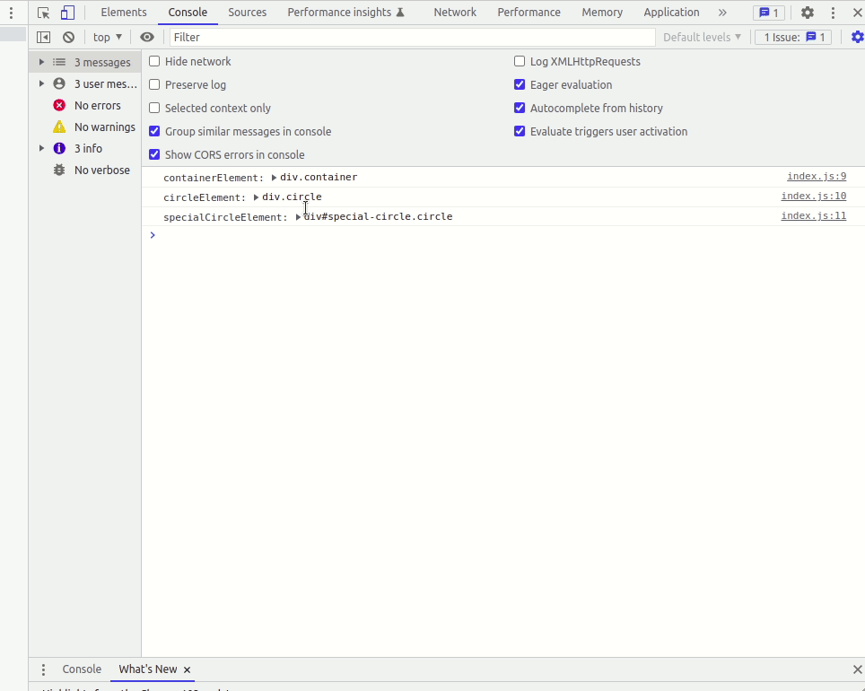
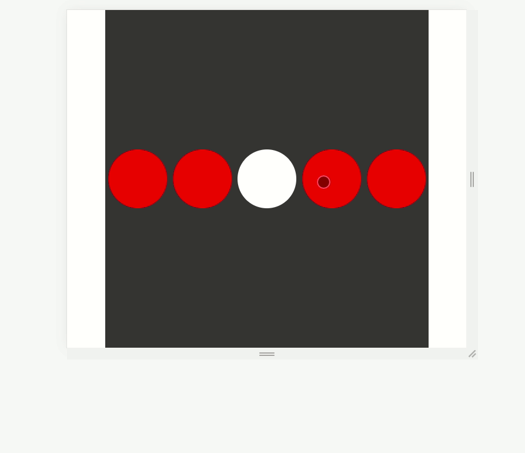
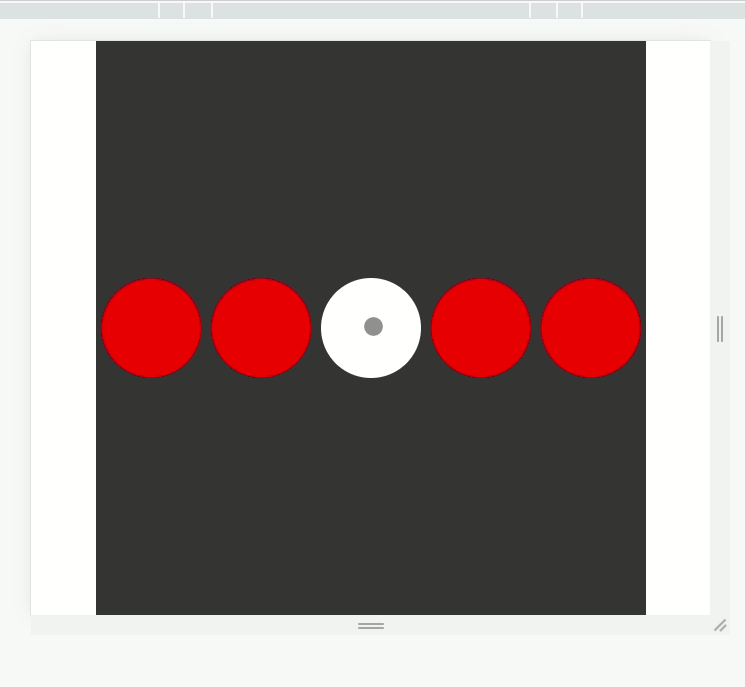
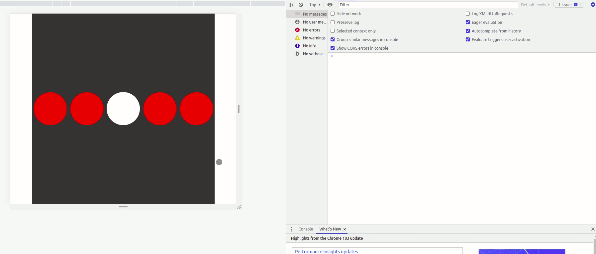

# SPA-DOM-EVENT-BUBBLING

Events makes it possible to have dynamic pages. So knowing how to work with them and understanding how they work is pretty important. A way to create events is by adding an event listener to an item in your DOM and you need to pass three different parameters. The first is the type of event that you want to track. The second is the callback or function that you want to execute when that event takes place and finally the type of propagation that is a boolean. Now that determines the order in which the event is tracked through the DOM. Most of the time this value is going to be false which means that the event bubbles up from the element that was the target up through the top of the DOM. The other option is a capturing event which does the reverse. It goes from the top of the DOM to the element that you're targeting. 

[Bubbling and capturing](https://javascript.info/bubbling-and-capturing)

##  What you will be doing.

You'll create two different events that will make you to understand the order of execution of them, change the order with the capture and learn how you can stop an event.

## Tasks

### Task 1 - Finding HTML elements

In the file ***index.js*** use Javascript syntax to find the classes ***circle*** and ***container*** and the id ***speciial-circle***

### Task 2 - Print HTML elements

Prints the items found in the console to make sure you have done everything right.

### Task 3 - Create the first event

Create an event listener that works by clicking on the HTML element that has the ***.container class***. As a callback/function you simply need to print: the ***event object***, the ***target*** and the ***currentTarget*** property of the event object in the console.

### Task 4 - Check event properties

Invest a couple of minutes to view all the properties of the event object and to understand the difference between target and currentTarget.

### Task 5 - Delete selected items

Use the ***event target*** and get to grab the parentNode of the target, then you will remove a child that is the target element. So essentially what this is going to do is just delete the element that you click on.

Use this documentations to help you https://www.javascripttutorial.net/javascript-dom/javascript-removechild/

### Task 6 - Create delete-condition

One problem is that if you click on the ***parent element*** it's actually going to remove that element as well because remember the event is being captured on the item with a class of container.
To solve this problem, create a condition that allows you to delete the selected element only if the target class is equal to "***circle***".

### Task 7 - Create second event

Create an event listener that works by clicking on the HTML element that has the ***special-circle id***. As a callback/function you simply need to print the event object in the console and change the ***background-color*** of the target to ***green***.
Remember to stop the first event that is triggered by clicking the ***.container class***. If you don't do this you will not be able to color ***special-circle id*** because it will be cancelled by the first event.

### Task 8 - Use capture

Change order of execution of events with ***capture***. To make things easier comment on the part of the code for the first event that removed the selected items (Task 5) and the part of the code for Task 7 that stops the first event.
Now print two different strings (e.g., "event1" and "event2") in the two events to figure out which event is executed first.

